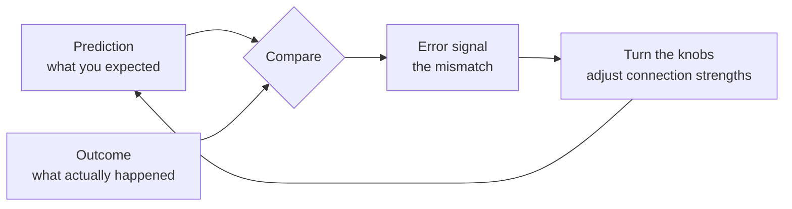
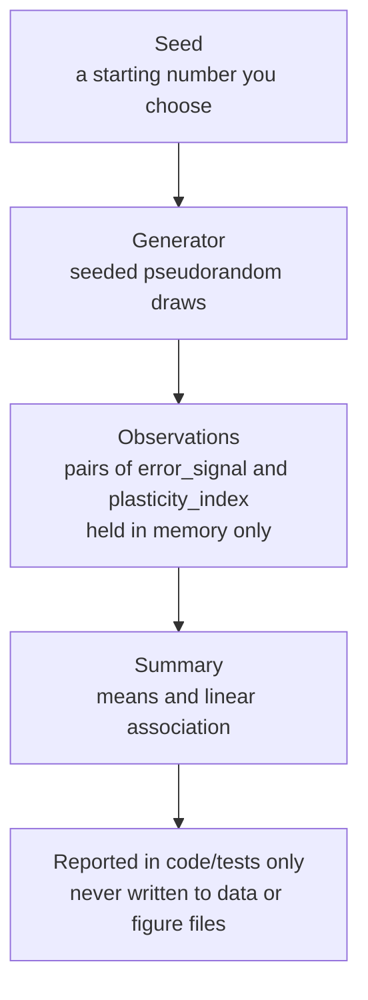
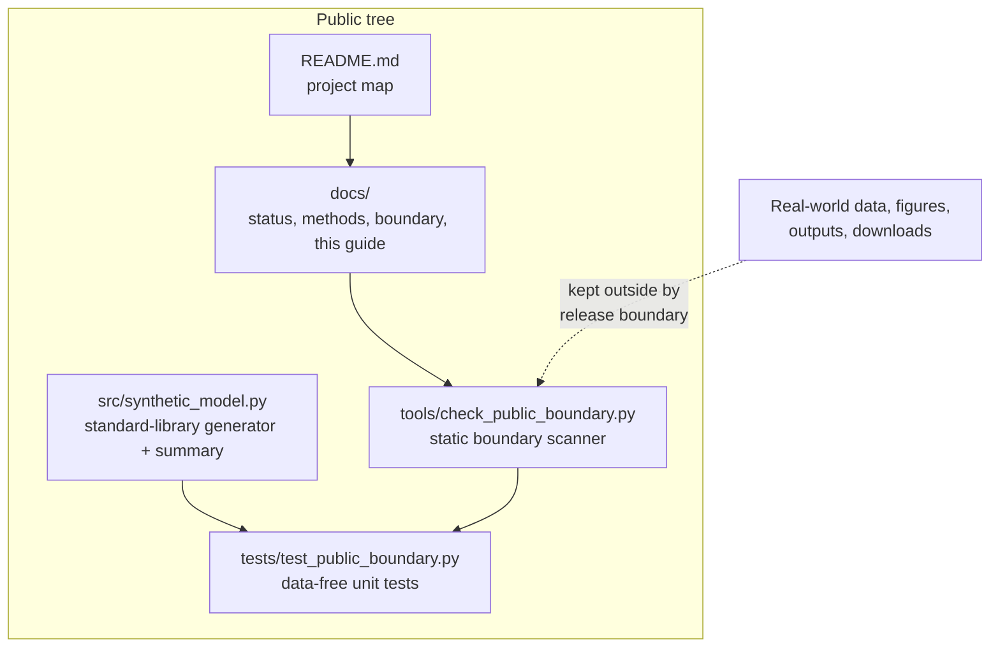

# Extended Introduction: Synapses, Plasticity, and Error-Driven Learning — From Zero

This guide assumes **no neuroscience background**. It builds every idea from an everyday analogy, then shows exactly how the small synthetic model in this repository works. Everything described here matches the actual code in `src/synthetic_model.py`.

---

## 1. Neurons and synapses: connection knobs

Your brain contains roughly 86 billion cells called **neurons**. A useful (very simplified) picture is to think of each neuron as a tiny decision-maker: it collects incoming signals from other neurons, adds them up, and if the total is strong enough it fires off its own signal to the next neurons in line.

Neurons are not directly welded together. Between them sit junctions called **synapses**. Here is the analogy we will use throughout:

> A synapse is like a **volume knob** on the connection between two neurons. When neuron A fires, neuron B hears it — but *how loudly* depends on the knob setting. A knob turned up means A's signal strongly influences B. A knob turned near zero means B barely notices A.

Real synapses are vastly more complicated than knobs — they involve chemical messengers, receptors, and physical structure — but "adjustable connection strength" is the right first mental model.

## 2. Synaptic plasticity: the brain turning its own knobs

**Synaptic plasticity** is the observation that these connection strengths are not fixed. They change as a result of activity. This matters enormously because it is the leading physical explanation for **learning and memory**: if experiences can turn some knobs up and others down, and those settings persist, then the pattern of knob settings *is* a stored memory.

A few things experiments have actually shown (full citations are in the reference list of [the short introduction](INTRODUCTION.md)):

- The **timing** of activity matters. Bi and Poo (1998) showed in cultured neurons that the order in which the two sides of a synapse fire can push the connection strength up or down. Markram and colleagues (1997) found related timing effects in cortical neurons.
- Timing is not the whole story: rate of activity and whether many inputs cooperate also matter (Sjostrom, Turrigiano, and Nelson, 2001). Caporale and Dan (2008) review this family of timing-dependent rules.
- Plasticity is not only electrical. Synaptic structures physically grow, shrink, appear, and disappear over time (Holtmaat and Svoboda, 2009). In one preparation, the neuromodulator dopamine promoted structural change only inside a narrow time window (Yagishita and colleagues, 2014).

So "the brain turns its knobs" is true, but biology uses many turning styles at once. Reviews such as Magee and Grienberger (2020) catalog several distinct forms of plasticity. There is **no single universal knob-turning rule** — which is exactly why researchers build simplified models.

## 3. Error-driven learning: turn knobs based on mistakes

Here is a second idea, this time from machine learning and psychology.

Imagine learning to throw darts. You throw, you see the dart land 10 cm left of the bullseye, and your next throw corrects for it. The **error** — the mismatch between what you predicted (bullseye) and what happened (10 cm left) — is what drives the adjustment. Learning driven by prediction mistakes is called **error-driven learning**.

This same idea powers modern AI. The back-propagation algorithm (Rumelhart, Hinton, and Williams, 1986) trains artificial neural networks by computing how wrong the network's output was and nudging every connection weight to reduce that error — billions of artificial knobs turned by mistakes. Separately, work on animal reward learning found that certain brain signals behave like a **prediction error**: they respond to the difference between expected and received reward (Schultz, Dayan, and Montague, 1997).

The exciting — and unresolved — question is whether biological synapses implement anything like this loop. Theoretical work on **three-factor learning rules** proposes that a local activity pattern at a synapse is stamped in only when a third, global signal (possibly error- or reward-related) arrives (Kuśmierz, Isomura, and Toyoizumi, 2017; Gerstner and colleagues, 2018). But AI-style error propagation is not known to map directly onto brain circuitry (Lillicrap and colleagues, 2020). The honest status: error-driven plasticity in biology is a hypothesis worth exploring, not an established fact.

## 4. Why simulate plasticity synthetically, with data-free ground truth?

If we want to study error-driven plasticity, why not just measure real brains? Because real experiments are slow, expensive, and full of confounds — and because a simulation lets you do something no experiment can:

> **In a synthetic model, you know the ground truth, because you programmed it.**

If the code says "the response is 0.4 times the error plus noise," then the true relationship is exactly that. You can then ask: does my summary statistic recover it? Does my code behave deterministically? Would my analysis pipeline catch a relationship if one existed? Numerical models are heuristic tools whose value depends on transparent assumptions and honest limits (Oreskes, Shrader-Frechette, and Belitz, 1994). Clear, complete model descriptions are what let a reader identify exactly which assumptions produced a result (Nordlie, Gewaltig, and Plesser, 2009), and good validation practice separates "the code runs reproducibly" from "the output matches real observations" (Gutzen and colleagues, 2018).

This repository deliberately does only the first kind of work. It is a **data-free synthetic conceptual model**: no real measurements enter, no empirical claim leaves.

## 5. The math this repository actually uses

Three small pieces of mathematics appear in `src/synthetic_model.py`. Each is explained in one plain sentence, with a friendly external link if you want depth.

**1. A uniform random draw for the error signal.** Each synthetic observation's `error_signal` is drawn uniformly between -1.0 and 1.0, meaning every value in that range is equally likely — like a spinner that stops anywhere on a dial with no favorite positions. ([Khan Academy — random variables and probability distributions](https://www.khanacademy.org/math/statistics-probability/random-variables-stats-library))

**2. A linear response plus noise for the plasticity index.** The code computes `plasticity_index = 0.4 * error_signal + noise`, where the noise is drawn from a bell-shaped (Gaussian) distribution centered at 0 with a typical spread of 0.25 — in words: the response follows the error with a fixed slope of 0.4, blurred by small random wobble. This is the same shape as the simplest linear model you may have seen as "y = m x + b with jitter." ([StatQuest — linear models and regression, clearly explained](https://www.youtube.com/@statquest))

**3. The Pearson correlation coefficient for the summary.** The `summarize_association` helper reports `r = Σ(e − ē)(p − p̄) / √(Σ(e − ē)² · Σ(p − p̄)²)`, which in plain language measures how consistently two quantities move together on a scale from -1 (perfectly opposite) through 0 (no linear pattern) to +1 (perfectly aligned). Because the generator builds in a positive slope, a long synthetic sequence will produce an association above zero by construction — that is the programmed ground truth, not a discovery. ([Seeing Theory — correlation and regression, interactive](https://seeing-theory.brown.edu/); [3Blue1Brown — visual intuition for the mathematics behind it](https://www.youtube.com/@3blue1brown))

Two safeguards accompany the summary: it refuses fewer than two observations, and it refuses input where either quantity never varies (the formula would divide by zero, because variation in both fields is what makes "moving together" definable at all).

## 6. How the repository is organized

- `src/` holds the entire model — one small module using only the Python standard library.
- `tests/` holds deterministic, in-memory tests (equal seeds must give equal sequences; invalid inputs must be rejected).
- `tools/` holds a scanner that checks tracked files against the project's public boundary (no data files, no figures, no outcome claims).
- `docs/` holds status, methods, and scope documents, including this one.

## 7. What to take away

1. Synapses are adjustable connections — knobs — between neurons, and plasticity is the brain adjusting them.
2. Error-driven learning means adjusting based on prediction mistakes; it is proven in AI and hypothesized, not established, in biology.
3. A synthetic model with programmed ground truth is a safe sandbox: you can verify the software exactly, while making zero empirical claims.
4. This repository contains only that sandbox. Its conclusions stop at "the code does what it says, deterministically."

## References

All scholarly references mentioned by author and year above — Bi and Poo (1998); Caporale and Dan (2008); Gerstner and colleagues (2018); Gutzen and colleagues (2018); Holtmaat and Svoboda (2009); Kuśmierz, Isomura, and Toyoizumi (2017); Lillicrap and colleagues (2020); Magee and Grienberger (2020); Markram and colleagues (1997); Nordlie, Gewaltig, and Plesser (2009); Oreskes, Shrader-Frechette, and Belitz (1994); Rumelhart, Hinton, and Williams (1986); Schultz, Dayan, and Montague (1997); Sjostrom, Turrigiano, and Nelson (2001); Yagishita and colleagues (2014) — are listed with links in the [References section of the introduction](INTRODUCTION.md). No new sources are introduced in this document.
