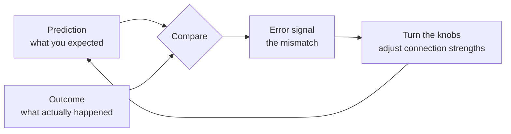
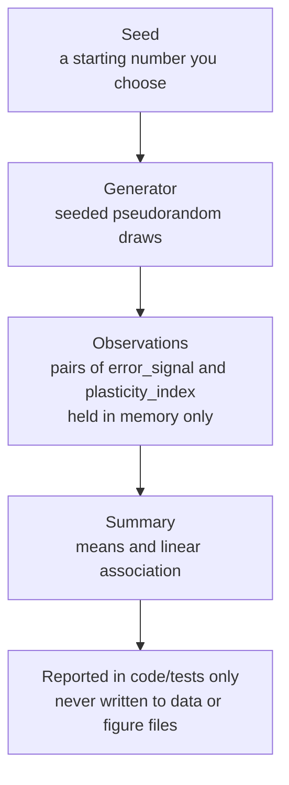
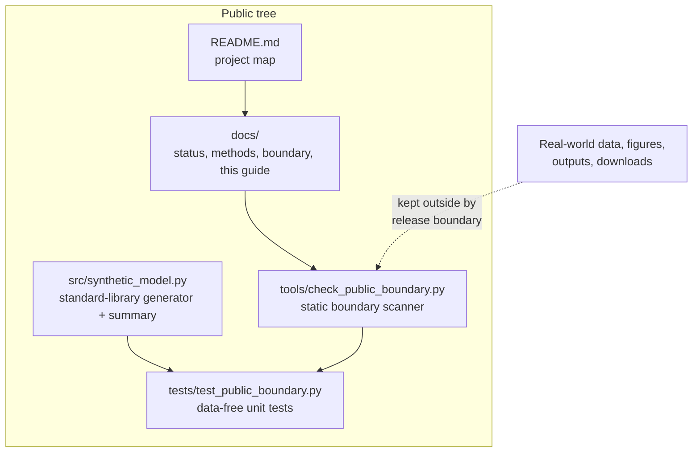

# Extended Introduction: Synapses, Plasticity, and Error-Driven Learning — From Zero

This guide assumes **no neuroscience background**. It builds every idea from an everyday analogy, then shows exactly how the small synthetic model in this repository works. Everything described here matches the actual code in `src/synthetic_model.py`.

Because no single mental model suits every reader, each core concept ends with a **"many roads"** subsection: several independent mathematical lenses on the same idea, each with one tiny fully-worked example on small integers. Take whichever road matches your intuition and skip the rest — they all arrive at the same place, and none needs calculus or differential equations.

## Start here: the math toolkit from zero

Every mathematical object used in this document is defined in this one section — three plain sentences or fewer each, plus one tiny numeric example checkable by hand. No schooling is assumed; if a symbol later looks strange, return here.

- **Variable.** A variable is a named slot that holds a number, like a labeled jar. The label stays; the contents can change. Example: let $w$ hold 2; after one learning step it may hold 6, still in the jar called $w$.
- **Subscript.** A subscript is a position label on a letter: $e_3$ means "the error at step 3." One letter then names a whole list. Example: if errors run 8, 4, 2, 1 then $e_1 = 8$ and $e_4 = 1$.
- **Function.** A function is a machine with one fixed rule: feed it a number, it returns a number. $f(x)$ means "the machine's output when fed $x$." Example: $f(x) = 0.4x$ gives $f(10) = 4$.
- **Set and membership.** A set is a collection of distinct things in curly braces; $\in$ means "is a member of." Example: for $B = \{-1, 0, 1\}$, $0 \in B$ and $2 \notin B$.
- **Sum, the symbol $\sum$.** The symbol $\sum$ means "add up everything in this range"; the labels say where counting starts and stops. Example: $\sum_{i=1}^{5} e_i$ with throws −10, +2, −12, +4, −8 gives $-24$.
- **Probability as a fraction of cases.** A probability is a count of favorable cases over a count of all cases, between 0 and 1. Example: if 100 of 400 spinner draws land in one quarter of the dial, that bin's probability is $100/400 = 0.25$.
- **Average (mean).** A mean is a total divided by how many items you added — the equal share. Example: the mean of −10, 2, −12, 4, −8 is $-24/5 = -4.8$.
- **Matrix (weight table).** A matrix is a table of numbers in rows and columns; here the cell at row A, column B holds the knob setting of connection A→B. Example: row A = (0, 2, 0) means A connects to B with knob 2 and to nothing else.
- **Weighted sum.** A weighted sum multiplies each item by a chosen weight and adds the results — how a neuron combines its inputs. Example: input 4 through knob 2 contributes $4 \times 2 = 8$.
- **Graph (nodes plus edges).** A graph is dots (nodes) joined by arrows (edges); a weighted edge carries a number, its knob. Example: A →(2) B is an arrow from A to B with weight 2.
- **Squared error.** Squaring a miss means multiplying it by itself, so sign cancels and big misses count extra. Example: misses of 8 and 1 square to 64 and 1 — the big one dominates the total.
- **Fixed point / rest point.** A fixed point of a rule is a value the rule leaves unchanged. Example: in "next guess = guess + step × error," any guess with error 0 is fixed, because adding 0 changes nothing.
- **Feedback loop / iteration.** Iteration is applying one rule to its own output, repeatedly — one table row per application. Example: the guesses 2 → 6 → 8 → 9 → 9.5 are one rule ("add half the error") iterated four times.
- **mod (remainder).** $a \bmod n$ is the remainder when $a$ is divided by $n$ — what is left after removing whole multiples of $n$. Example: $24 \bmod 10 = 4$, and $(7 \times 1 + 3) \bmod 10 = 0$.
- **$\log_2$, the number of halvings.** $\log_2(n)$ asks how many times you can halve $n$ before reaching 1 — the number of yes/no questions that pin down one of $n$ equally likely options. Example: $\log_2(4) = 2$, because $4 \to 2 \to 1$ is two halvings.

---

## 1. Neurons and synapses: connection knobs

Your brain contains roughly 86 billion cells called **neurons**. A useful (very simplified) picture is to think of each neuron as a tiny decision-maker: it collects incoming signals from other neurons, adds them up, and if the total is strong enough it fires off its own signal to the next neurons in line.

Neurons are not directly welded together. Between them sit junctions called **synapses**. Here is the analogy we will use throughout:

> A synapse is like a **volume knob** on the connection between two neurons. When neuron A fires, neuron B hears it — but *how loudly* depends on the knob setting. A knob turned up means A's signal strongly influences B. A knob turned near zero means B barely notices A.

Real synapses are vastly more complicated than knobs — they involve chemical messengers, receptors, and physical structure — but "adjustable connection strength" is the right first mental model.

## 2. Synaptic plasticity: the brain turning its own knobs

**Synaptic plasticity** is the observation that these connection strengths are not fixed. They change as a result of activity. This matters enormously because it is the leading physical explanation for **learning and memory**: if experiences can turn some knobs up and others down, and those settings persist, then the pattern of knob settings *is* a stored memory.

A few things experiments have actually shown (full citations are in the reference list of [the short introduction](INTRODUCTION.md)):

- The **timing** of activity matters. Experiments in cultured neurons showed that the order in which the two sides of a synapse fire can push the connection strength up or down, and related timing effects were found in cortical neurons.
- Timing is not the whole story: rate of activity and whether many inputs cooperate also matter, and reviews of this family of timing-dependent rules catalog the variety.
- Plasticity is not only electrical. Synaptic structures physically grow, shrink, appear, and disappear over time. In one preparation, a modulatory chemical signal promoted structural change only inside a narrow time window.

So "the brain turns its knobs" is true, but biology uses many turning styles at once. Modern reviews catalog several distinct forms of plasticity. There is **no single universal knob-turning rule** — which is exactly why researchers build simplified models.

### The many roads to a synapse

**Road 1: linear algebra as weight tables.** Write every connection as a cell in a table: rows are sender neurons, columns are receivers, and the cell holds the knob setting. Worked example with three neurons: the table has row A = (0, 2, 0), row B = (0, 0, 1), row C = (3, 0, 0), meaning A→B has knob 2, B→C knob 1, C→A knob 3. If A fires with strength 4, B hears 4 × 2 = 8 — one lookup, one multiplication. The entire network's behavior is the table times the activity list. Formally, the table is a matrix $W$ and what a receiver hears is a weighted sum,

$$W = \begin{pmatrix} 0 & 2 & 0 \\ 0 & 0 & 1 \\ 3 & 0 & 0 \end{pmatrix}, \qquad \text{input to } B = \sum_i W_{i,B}\, a_i = 0 \times 0 + 2 \times 4 + 0 \times 0 = 8$$

where $W_{i,B}$ is the knob from sender $i$ to receiver $B$ and $a_i$ is $i$'s firing strength — only sender A is active, so the sum collapses to the worked $4 \times 2 = 8$. *What this buys you:* the whole circuit as one auditable table; learning is editing cells. *What it costs you:* a table cell is static; real synapses have history-dependent state the cell hides.

**Road 2: graph theory.** A synapse is a directed, weighted edge: A →(2) B. Plasticity is edge-weight editing; memory is the current edge-weight list. Worked example on the 3-node cycle A→B, B→C, C→A with weights 2, 1, 3: total weight is 6; if learning strengthens the A→B edge to 3, every path starting at A carries one extra unit — you can trace the consequences by walking the graph. Formally,

$$G = (V, E, w), \qquad \text{total weight} = \sum_{e \in E} w(e) = 2 + 1 + 3 = 6$$

where $V$ is the node set, $E$ the edge set, and $w(e)$ the weight of edge $e$ — after the edit, $w(A \to B) = 3$ and the same sum gives 7, one extra unit, exactly the worked change. *What this buys you:* structural questions (which paths exist, which edges are bottlenecks) separate from dynamical ones. *What it costs you:* the graph records where knobs are, not when or why they turn.

**Road 3: automata.** A synapse is a machine with one memory slot (its current weight) and an update rule (its plasticity rule). Worked example, rule "when both sides fire together, add 1 to the slot, capped at 5": starting at 2, co-firing three times gives 2 → 3 → 4 → 5 → (cap) 5. The cap row of the transition table is what prevents runaway growth. Formally the slot $w$ updates by

$$w \leftarrow \min(w + 1,\ 5) \ \text{on co-firing}, \qquad 2 \to 3 \to 4 \to 5 \to \min(6, 5) = 5$$

where $\leftarrow$ reads "is replaced by" and the $\min$ is the cap — the worked sequence, including the capped fourth step, is this one rule applied four times. *What this buys you:* plasticity as a transition table — finite, inspectable, simulable. *What it costs you:* real synaptic state is richer than one slot; the machine is a deliberate cartoon.

## 3. Error-driven learning: turn knobs based on mistakes

Here is a second idea, this time from machine learning and psychology.

Imagine learning to throw darts. You throw, you see the dart land 10 cm left of the bullseye, and your next throw corrects for it. The **error** — the mismatch between what you predicted (bullseye) and what happened (10 cm left) — is what drives the adjustment. Learning driven by prediction mistakes is called **error-driven learning**.

This same idea powers modern AI. The back-propagation algorithm trains artificial neural networks by computing how wrong the network's output was and nudging every connection weight to reduce that error — billions of artificial knobs turned by mistakes. Separately, work on animal reward learning found that certain brain signals behave like a **prediction error**: they respond to the difference between expected and received reward.

The exciting — and unresolved — question is whether biological synapses implement anything like this loop. Theoretical work on **three-factor learning rules** proposes that a local activity pattern at a synapse is stamped in only when a third, global signal (possibly error- or reward-related) arrives; related reviews describe eligibility-based accounts of plasticity on behavioral time scales. But AI-style error propagation is not known to map directly onto brain circuitry. The honest status: error-driven plasticity in biology is a hypothesis worth exploring, not an established fact.

### The many roads to error-driven learning

**Road 1: discrete iterated maps.** The learning loop is one rule: next guess = current guess + step × error, iterated. Worked example: target 10, step 0.5, starting guess 2. Errors are 8, 4, 2, 1, so guesses run 2 → 6 → 8 → 9 → 9.5 — halving the gap each time, like the shower-knob table every feedback discussion uses. Learning *is* the iteration; there is no equation of motion behind it. Formally, with guess $w_t$, target $y$, and step size $\eta$,

$$e_t = y - w_t, \qquad w_{t+1} = w_t + \eta\, e_t, \qquad w_1 = 2 + 0.5 \times (10 - 2) = 6,\ \ w_2 = 6 + 0.5 \times 4 = 8$$

where $e_t$ is the mismatch, $\eta$ is the step size (0.5 here), and the worked sequence 2 → 6 → 8 → 9 → 9.5 is this one line iterated. *What this buys you:* training dynamics as a hand-runnable table; "will it converge?" becomes "does the gap shrink row by row?" — with step 2.0 the same rule gives $w_1 = 2 + 2 \times 8 = 18$, then $w_2 = 18 + 2 \times (-8) = 2$, then 18 again — the worked 2 → 18 → −6 → 26 explosion's arithmetic made explicit. *What it costs you:* you see the process only at discrete steps, and the fixed step size is a choice the table cannot justify.

**Road 2: geometry.** Prediction and outcome are two points; the error is the distance between them, and learning is walking downhill on the landscape whose height is squared error. Worked example: predictions 2 and 8 against a target of 10 sit at squared-error heights (10−2)² = 64 and (10−8)² = 4; moving the guess from 2 to 6 descends from height 64 to 16. "Gradient descent" is just "always step toward lower ground," no calculus needed at this scale. Formally, the height function is

$$L(w) = (y - w)^2, \qquad L(2) = 64,\ \ L(6) = 16,\ \ L(8) = 4$$

where $L(w)$ is the squared miss of guess $w$ — the worked heights — and "downhill" means choosing the next guess so $L$ shrinks, which it does at every worked step. *What this buys you:* a picture of learning as descending a bowl, including the failure mode of getting stuck in a local dip. *What it costs you:* the bowl is a metaphor in high dimensions, and the picture hides that the landscape itself is defined by your error measure.

**Road 3: game theory as best response.** Each knob is a player whose payoff is negative squared error; each round, every player nudges its own setting to improve its payoff given the others' current settings. Learning converges when no single knob wants to move — a nobody-wants-to-move rest point. Worked example with two knobs (a, b) and error = target − (a + b), target 4: start (0, 0), error 4; knob a best-responds by moving to 4 (error 0); now knob b sees error 0 and stays; the rest point (4, 0) — and equally (1, 3) or (2, 2) — solves the task. Notice there are many rest points: the game finds *a* solution, not *the* solution. Formally, a rest point is a pair where neither knob can improve,

$$e = y - (a + b), \qquad \text{rest point: } a + b = y, \quad \text{e.g. } (4, 0),\ (1, 3),\ (2, 2) \text{ all give } e = 0$$

where the condition $a + b = y$ is exactly "no knob wants to move," and the worked examples all satisfy it — the multiplicity of rest points is visible in the equation itself. *What this buys you:* an explanation of why different training runs land on different weight settings that all work. *What it costs you:* real training updates are coupled, not neatly turn-based.

**Road 4: probability as frequencies.** The error signal is only trustworthy as an average. One dart throw landing left might be a gust of wind; ten throws averaging 10 cm left is a systematic bias. Worked example: five throws land at −10, +2, −12, +4, −8 cm relative to target; the signs alone are noisy (3 negative, 2 positive), but the mean is (−10 + 2 − 12 + 4 − 8)/5 = −24/5 = −4.8 cm — the tally reveals a leftward bias no single throw proved. Learning rules that average over many errors are exploiting exactly this. Formally,

$$\bar{e} = \frac{1}{n} \sum_{i=1}^{n} e_i = \frac{-10 + 2 - 12 + 4 - 8}{5} = \frac{-24}{5} = -4.8 \text{ cm}$$

where the $\sum$ adds the five signed misses and dividing by $n = 5$ turns the total into the average bias — the worked tally restated. *What this buys you:* noise-averaging as a recount anyone can do. *What it costs you:* averaging assumes the noise has no drift of its own; a slowly shifting bias hides inside the average.

## 4. Why simulate plasticity synthetically, with data-free ground truth?

If we want to study error-driven plasticity, why not just measure real brains? Because real experiments are slow, expensive, and full of confounds — and because a simulation lets you do something no experiment can:

> **In a synthetic model, you know the ground truth, because you programmed it.**

If the code says "the response is 0.4 times the error plus noise," then the true relationship is exactly that. You can then ask: does my summary statistic recover it? Does my code behave deterministically? Would my analysis pipeline catch a relationship if one existed? Numerical models are heuristic tools whose value depends on transparent assumptions and honest limits. Clear, complete model descriptions are what let a reader identify exactly which assumptions produced a result, and good validation practice separates "the code runs reproducibly" from "the output matches real observations."

This repository deliberately does only the first kind of work. It is a **data-free synthetic conceptual model**: no real measurements enter, no empirical claim leaves.

### The many roads to a random draw (and a seed)

**Road 1: statistical mechanics by counting.** "Uniformly random between −1 and 1" means every small sub-interval is equally *populated* over many draws. Chop the range into 4 bins; in 400 draws each bin collects about 100 tallies — not because anything forces fairness each time, but because the fair worlds vastly outnumber the lopsided ones. A bell-shaped distribution is the same idea with uneven multiplicity: middle values have more ways to happen. Formally, uniformity is equal fractions of cases,

$$P(\text{draw lands in bin } k) = \frac{\text{bin width}}{\text{total width}} = \frac{0.5}{2} = 0.25 \ \text{ for each of the 4 bins}$$

where the fraction is width over total width — the worked tally of about 100 per bin in 400 draws is this $0.25$ applied four times. *What this buys you:* randomness as counting, with no mystique. *What it costs you:* counts describe crowds, not the next draw.

**Road 2: automata and computation.** A seeded generator is a pure state machine: state = the seed, transition = a fixed scrambling rule, output = the next "random" number. Same seed, same state sequence, same outputs — which is why the test "equal seeds give equal sequences" is a complete determinism check. Worked example with toy rule next = (7 × current + 3) mod 10, seed 1: 1 → (7+3) mod 10 = 0 → 3 → 24 mod 10 = 4 → 1 → … The outputs 0, 3, 4 look patternless at a glance, yet the machine is perfectly deterministic and repeats forever. Formally the machine is one iterated rule,

$$s_{n+1} = (7\, s_n + 3) \bmod 10, \qquad s_0 = 1 \to 0 \to 3 \to 4 \to 1 \to \cdots$$

where $\bmod\ 10$ keeps only the remainder after dividing by 10 (see the toolkit) — $7 \times 0 + 3 = 3$ and $7 \times 3 + 3 = 24 \to 4$ reproduce the worked sequence step by step. *What this buys you:* "random" numbers you can reproduce exactly — the foundation of every test here. *What it costs you:* the toy rule cycles quickly (period 4); real generators have astronomically long cycles, but the principle is identical.

## 5. The math this repository actually uses

Three small pieces of mathematics appear in `src/synthetic_model.py`. Each is explained in one plain sentence; the toolkit section at the top defines every symbol used.

**1. A uniform random draw for the error signal.** Each synthetic observation's `error_signal` is drawn uniformly between -1.0 and 1.0, meaning every value in that range is equally likely — like a spinner that stops anywhere on a dial with no favorite positions. Formally, $e \sim U(-1, 1)$, meaning every sub-interval of width $w$ in $[-1, 1]$ gets the fraction $w/2$ of all draws — a width-0.5 interval gets $0.5/2 = 0.25$, the toolkit's fraction-of-cases.

**2. A linear response plus noise for the plasticity index.** The code computes `plasticity_index = 0.4 * error_signal + noise`, where the noise is drawn from a bell-shaped (Gaussian) distribution centered at 0 with a typical spread of 0.25 — in words: the response follows the error with a fixed slope of 0.4, blurred by small random wobble. This is the same shape as the simplest linear model you may have seen as "y = m x + b with jitter." Formally,

$$p = 0.4\, e + \varepsilon, \qquad \varepsilon \sim \text{bell-shaped, center } 0, \text{ spread } 0.25$$

where $e$ is the error signal, $p$ the plasticity index, and $\varepsilon$ the wobble — for example, $e = 1$ with wobble $\varepsilon = -0.1$ gives $p = 0.4 \times 1 - 0.1 = 0.3$.

**3. The correlation coefficient for the summary.** The `summarize_association` helper reports the correlation coefficient, which in plain language measures how consistently two quantities move together on a scale from -1 (perfectly opposite) through 0 (no linear pattern) to +1 (perfectly aligned). Formally,

$$r = \frac{\sum_i (e_i - \bar{e})(p_i - \bar{p})}{\sqrt{\sum_i (e_i - \bar{e})^2}\;\sqrt{\sum_i (p_i - \bar{p})^2}}$$

where $\bar{e}$ and $\bar{p}$ are the two means, each factor $(e_i - \bar{e})$ reads "was this observation above or below its own average, and by how much," and the denominator divides out the scales so $r$ lands between $-1$ and $1$. Worked check with two observations: centered lists $(-1, 1)$ and $(-2, 2)$ give numerator $(-1)(-2) + (1)(2) = 4$ and denominators $\sqrt{2}\sqrt{8} = 4$, so $r = 4/4 = +1$ — perfect alignment. Because the generator builds in a positive slope, a long synthetic sequence will produce an association above zero by construction — that is the programmed ground truth, not a discovery.

Two safeguards accompany the summary: it refuses fewer than two observations, and it refuses input where either quantity never varies (the formula would divide by zero, because variation in both fields is what makes "moving together" definable at all). Formally it requires $n \ge 2$ and $\sum_i (e_i - \bar{e})^2 > 0$ and $\sum_i (p_i - \bar{p})^2 > 0$ — if all $e_i$ equal 3, the first sum is 0 and the check refuses.

### The many roads to a correlation

**Road 1: probability as frequencies (the native road).** Count co-movements. For each observation, ask two yes/no questions: is e above its mean? is p above its mean? Tally the four combinations. Worked example with 4 observations: (above, above): 2, (above, below): 0, (below, above): 0, (below, below): 2. Every observation lands on the diagonal — perfect agreement — so the coefficient comes out at +1. If the off-diagonal cells had filled instead, the tally would signal opposition (r near −1); a scattered tally signals no pattern (r near 0). The formula in the code is this tally with the yes/no replaced by *how far* above or below. Formally the tally is a frequency count,

$$\text{agreement} = \frac{\#\{i : \mathbb{1}[e_i > \bar{e}] = \mathbb{1}[p_i > \bar{p}]\}}{n} = \frac{4}{4} = 1$$

where $\mathbb{1}[\cdot]$ is the yes/no checker from the toolkit (1 if true, 0 if not) — all four observations agree, so the count gives 1, matching the diagonal tally. *What this buys you:* correlation as an auditable four-cell count. *What it costs you:* co-movement tallies cannot see curved relationships — a perfect U-shape tallies as "no pattern."

**Road 2: geometry.** Treat the two centered quantity lists as arrows in a space with one axis per observation; the correlation is the angle between the arrows. Pointing the same way (angle 0) gives a coefficient of +1; a right angle gives 0; opposite ways give r = −1. Worked example with 2 observations: centered lists (e1, e2) = (−1, 1) and (p1, p2) = (−2, 2) point along exactly the same line — the second is the first scaled by 2 — so the coefficient comes out at +1. Formally the coefficient is the cosine of the angle $\theta$ between the arrows,

$$r = \cos\theta = \frac{a \cdot b}{\|a\|\,\|b\|} = \frac{(-1)(-2) + (1)(2)}{\sqrt{2}\,\sqrt{8}} = \frac{4}{4} = 1$$

where $a \cdot b$ is the dot product (multiply matching entries, add the results) and $\|a\|$, $\|b\|$ are the arrow lengths — the worked lists give $r = 1$, "pointing the same way." *What this buys you:* "moving together" as literally pointing together. *What it costs you:* the picture lives in as many dimensions as you have observations, so it is an exact metaphor, not a drawable one.

**Road 3: information theory by counting.** A strong correlation means knowing one quantity answers questions about the other. If p is exactly 0.4 × e and you know e to within 4 bins, you know p to within 4 bins too — knowing e answered every question about p. With the noise of spread 0.25 added, knowing e narrows p but leaves residual questions; the correlation measures the fraction answered. Formally, in the exact case the residual question count is zero,

$$\text{questions about } p \text{ answered by } e = \log_2(\text{bins before}) - \log_2(\text{bins after}) = \log_2(4) - \log_2(4) + \log_2(4) - \log_2(4) \to \text{all}$$

where in words: pinning $e$ to one of 4 bins pins $p = 0.4e$ to one of 4 bins, so the 2 questions you spent on $e$ answer all 2 questions about $p$ — $\log_2(4) = 2$ questions transferred in full. *What this buys you:* a question-counting meaning for intermediate values like 0.7 (most, not all, questions answered). *What it costs you:* the conversion between r and an exact question count depends on distribution assumptions, so treat it as intuition.

## 6. How the repository is organized

- `src/` holds the entire model — one small module using only the Python standard library.
- `tests/` holds deterministic, in-memory tests (equal seeds must give equal sequences; invalid inputs must be rejected).
- `tools/` holds a scanner that checks tracked files against the project's public boundary (no data files, no figures, no outcome claims).
- `docs/` holds status, methods, and scope documents, including this one.

## 7. What to take away

1. Synapses are adjustable connections — knobs — between neurons, and plasticity is the brain adjusting them.
2. Error-driven learning means adjusting based on prediction mistakes; it is proven in AI and hypothesized, not established, in biology.
3. A synthetic model with programmed ground truth is a safe sandbox: you can verify the software exactly, while making zero empirical claims.
4. This repository contains only that sandbox. Its conclusions stop at "the code does what it says, deterministically."

## References

All scholarly references mentioned in the short introduction — on spike-timing-dependent plasticity in cultured and cortical neurons, rate and cooperativity effects, structural plasticity and modulatory time windows, reviews of plasticity rules, the back-propagation algorithm, reward prediction-error signals, three-factor and eligibility-based learning rules, the mapping problem between AI-style error propagation and brain circuitry, and the validation of numerical models — are listed with full details in the [References section of the introduction](INTRODUCTION.md). No new sources are introduced in this document.

## Choosing your road

If you think in tables of numbers, take **linear algebra as weight tables** — a network is a table and learning edits cells. If you think in step-by-step rules, take **discrete iterated maps** — training is "next guess = guess + step × error" repeated. If you think in pictures, take **geometry** — error is distance, learning is downhill, correlation is an angle. If you think in tallies, take **probability as frequencies** — a noise-averaged error and a correlation are both recounts. If you think in machines, take **automata** — a synapse is a slot plus an update rule, and a seeded generator is a scrambling machine. If you think in counting worlds, take **statistical mechanics** — randomness is multiplicity. If you think in incentives, take **game theory** — training ends where no knob wants to move. If you think in questions, take **information theory** — correlation is how many questions one quantity answers about another.
