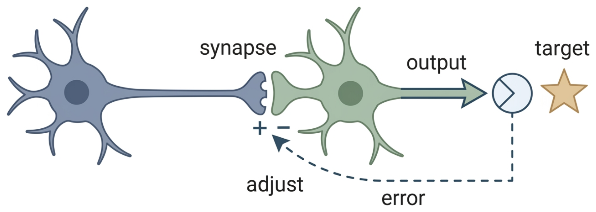

# Introduction: Error-Driven Learning and Synaptic Plasticity

> ## Start here
>
> This repository is a small, deterministic software example. It creates two illustrative, generated values—an **error-like** value and a **response-like** value—and summarizes a relationship that the program itself constructs. It contains **no biological measurements** and does **not** test whether a brain uses an error-driven plasticity rule.
>
> The background below explains why words such as *error*, *synapse*, and *plasticity* are useful in science. That background is not a result from this repository. The repository's bounded result is only that its seed-controlled program can represent and describe a programmed relationship between synthetic values.

*Figure 1: A neuron's output is compared with a target; the error signal flows backward to adjust the synapse strengths. (Editable Mermaid source: [figures/concept_figure.md](figures/concept_figure.md).)*

## A concept ladder: from cells to a software example

### 1. Neurons communicate

A **neuron** is a cell in the nervous system that receives and sends signals. A neuron has receiving branches, called **dendrites**, and a sending extension, called an **axon**. When a neuron sends a brief electrical signal, it is often called an **action potential** or **spike**. At many connections, that electrical event leads the sending cell to release a chemical signal. The chemical crosses a tiny gap and affects the receiving cell. General background explainers describe this basic sequence and the names for its parts.[16] [17]

The small junction where one cell can influence another is a **synapse**. The sending side is **presynaptic** and the receiving side is **postsynaptic**. These words only identify the two sides of a connection. They do not say how much influence one cell has, why the connection changes, or what a person is thinking or doing.

### 2. A synapse can change

**Synaptic plasticity** means that some features of communication at a synapse can change over time. **Synaptic strength** is a convenient, context-dependent way to describe how much activity in one cell influences another under a stated experimental condition. It is not a single visible dial that works the same way at every synapse. A short public introduction to plasticity can help establish this meaning before technical research papers are read.[18]

Scientists study plasticity in particular experimental preparations. They specify the cells, signals, timing, and measurement being used. Work has shown that a measured change can depend on the relative timing of activity on the two sides of a synapse, the connection's starting state, cell type, and broader context.[3] [4] Synaptic structures can also form, disappear, and change over time; this is often called **structural plasticity**.[5]

This context matters. A finding in one preparation is not automatically a rule for every connection in every brain. For example, cortical experiments have reported different measured changes when the timing relationship between a postsynaptic action potential and an excitatory postsynaptic potential was changed.[8] Other cortical work described joint roles for rate, timing, and cooperativity.[9] In one defined preparation, dopamine was reported to promote enlargement of dendritic spines only within a limited interval after glutamatergic input.[10] These are examples from particular studies, not one universal update rule.

### 3. A learning rule is a proposed description, not automatically a biological fact

A **learning rule** is a proposed description of when a connection or a value should change. A rule can be written as mathematics or as instructions for a computer. In an artificial neural network, **back-propagation** is an algorithm that adjusts artificial connection weights to reduce a defined difference between an output and a desired output.[1] That is useful for building and studying software. It does not, by itself, show that biological synapses use the same procedure.

Researchers use several families of descriptions when comparing possible forms of synaptic plasticity, including correlation-based, three-factor, and supervised descriptions.[11] A **three-factor** description considers a local relation involving presynaptic and postsynaptic activity together with an additional signal that may control or gate change. This framework helps organize candidate rules. It does not establish that a particular synapse computes a mathematically defined error.[12] [13]

A concrete hypothetical example can make the distinction clearer. Imagine a computer program with a number for a guess and a number for the answer. The program can subtract one from the other, call the difference an error, and use a written rule to change its next guess. That is a definition inside the program. A biological experiment would instead need to say what signal was measured from which cells, in what preparation, and why that measurement should count as evidence for a proposed rule. A similarly named quantity does not turn the computer number into a measurement from a neuron.

### 4. One word, three levels: “error”

The word **error** can mean different things. Naming the level prevents an important misunderstanding.

| Level | Plain-language meaning | What it does **not** establish |
| --- | --- | --- |
| An algorithm | A number defined by a rule to compare an output or expectation with a target or outcome. | That neurons use that exact rule. |
| A biological study | A measured signal or a hypothesis about signals in a stated preparation. | That every synapse, task, or species follows the same rule. |
| This repository | A generated variable labeled *error-like*. | A biological measurement, a record of reward prediction error, or evidence of plasticity. |

A **reward prediction error** is one specific use of the word: in a learning framework, it compares a received reward with a predicted reward.[2] It should not be treated as another name for every neural signal, or for the error-like variable generated here. The same word can be useful at several levels, but the level must always be named.

## What biological evidence would require

A single synthetic error variable cannot stand in for biological evidence. A biological claim needs a defined preparation, measured signals, an experimentally justified update rule, and evidence that alternative explanations have been addressed. The need for those details follows from the fact that plasticity studies concern particular cells and conditions, rather than a universal connection-setting mechanism.

This distinction is not a rejection of models. Models can make an idea precise enough to inspect and question. But a model and an observation have different jobs. An observation records something from the world using a stated method. A model makes choices about what to include, what to leave out, and how the included parts relate. A model can motivate a question, but its assumptions are not independent confirmation of the question.

Artificial learning rules can therefore inspire biological hypotheses without mapping directly onto biological circuitry. Efficient error propagation in artificial networks is not known to map directly onto the brain.[6] More generally, numerical models are useful only insofar as their assumptions are transparent, their consequences can be tested, and their outputs are compared with appropriate observations when an empirical claim is being considered.[7]

## How to read this synthetic example

The repository is a **working synthetic conceptual model**. It creates error-like and response-like values in memory, then calculates a descriptive summary of their linear association. Here, **synthetic** means created by the program for illustration, not measured from an external system.

The model is **seed-controlled**. A seed is a starting value that lets a program repeat the same sequence of **pseudorandom** variation: computer-generated variation that can look irregular while still being repeatable when the same settings are used. Equal seeds and otherwise equal calls produce equal in-memory sequences in this implementation. This repeatability lets a reader check that the software behaves as specified. It does not make the values biological observations.

The word **association** here means a numerical description of how two values vary together. It is not a statement that one value causes the other. In this repository, the limitation is stronger still: the generator creates the relationship before the summary describes it. The summary is therefore an inspection of the program's design, not an independent test of that design, a causal finding, or a comparison with biological data.

For a simple hypothetical illustration, suppose a recipe tells a program first to generate a number called *error-like*, then to generate a second number partly from the first, and finally to report whether the two tend to move together. If the program reports an association, it has shown that its own recipe produced values with that pattern. It has not shown that a brain, a person, or any other external system produced the pattern. The code in this repository has that limited explanatory role: it makes a constructed relationship inspectable.

Clear model descriptions help readers identify which components, parameters, and assumptions produced a simulation result.[15] Proposed validation workflows in computational neuroscience likewise distinguish reproducible implementation from comparing simulated activity with suitable reference data.[14] This repository supports the first kind of inspection for its synthetic generator. It does **not** compare its output with biological observations.

## Project status: completed software work, no empirical result

The completed work is deliberately narrow. The implementation generates seed-controlled error-like and response-like values in memory. It summarizes their linear association and has documented safeguards for inputs that are too limited or do not vary. Its tests cover repeatable synthetic generation, invalid summary inputs, and the public-boundary checks for the defined synthetic behaviors.

That completed work supports one software-level claim: the repository can represent a programmed relationship between illustrative variables and describe that relationship within the model. The relationship is constructed by the implementation. The generated values are not measurements, and the association is not evidence from a real-world system.

No empirical plasticity analysis has been implemented. The repository contains no observed data, benchmark, figure, or comparison with an external observation. It therefore has **no positive, negative, or null empirical result** to report. It does not establish a biological, behavioral, clinical, or technical effect. It also does not show that an error-like signal causes a change in a connection, that a response-like value is a valid measure of plasticity, or that a similar pattern would appear outside this synthetic setting.

Important questions remain unresolved because they have not been tested here. There is no data-ingestion path, source-specific adapter, provenance layer, empirical evaluation, result-reporting workflow, or figure-generation workflow. The repository cannot distinguish its programmed relationship from plausible alternatives in an observed setting. Nothing in the current documentation should be read as evidence that a future empirical study will support the model.

A future empirical project would need predefined measures, inclusion criteria, outcomes, analysis rules, and interpretation limits before results are accessed. Until such work is separately designed, appropriately bounded, and completed elsewhere, the correct conclusion remains limited to the implemented synthetic model.

## Glossary

| Term | Plain-language meaning |
| --- | --- |
| **Neuron** | A cell in the nervous system that receives, processes, and sends signals. |
| **Axon and dendrite** | An axon carries signals away from a neuron; dendrites receive many signals from other cells. |
| **Synapse** | A small junction through which one cell can influence another cell. |
| **Presynaptic / postsynaptic** | The sending side / the receiving side of a synaptic connection. |
| **Action potential (spike)** | A brief electrical event used by many neurons to send a signal along an axon. |
| **Neurotransmitter** | A chemical signal released at many synapses that affects a receiving cell. |
| **Synaptic strength** | A context-dependent description of how much one cell's activity influences another at a synapse. |
| **Synaptic plasticity** | A change over time in properties of communication at a synapse. |
| **Long-term potentiation (LTP) / long-term depression (LTD)** | Common names for persistent increases / decreases in a measured aspect of synaptic efficacy in particular experimental contexts. |
| **Dendritic spine** | A small structure on many dendrites where excitatory synapses can occur. |
| **Error / reward prediction error** | An error is a defined mismatch. A reward prediction error specifically compares received and predicted reward; it is not a generic name for every neural signal. |
| **Back-propagation** | An algorithm for changing connection weights in an artificial neural network using a defined output error. It is not automatically a biological mechanism. |
| **Three-factor rule** | A model family that combines local presynaptic and postsynaptic activity with an additional signal when describing possible synaptic updates. |
| **Association** | A numerical description of how two values vary together. Association alone does not establish that one causes the other. |
| **Pseudorandom / seed** | Computer-generated variation controlled by an initial value; using the same seed can reproduce the same sequence. |
| **Synthetic value** | A value created by a program for illustration rather than measured from an external system. |
| **Empirical measurement** | A quantity observed or recorded from the world using a stated method and setting. |
| **Model assumption** | A choice built into a model that affects its behavior and must not be mistaken for a discovered fact. |

## Learn the basics in this order

> **General background only.** Every external educational and scholarly resource in this learning path is offered to explain general concepts. None is evidence for this repository's generated relationship or for a repository-specific biological claim.

1. Start with the National Institute of Neurological Disorders and Stroke's introductory page, **“Brain Basics: Know Your Brain.”** Read its sections on neurons and synapses for the basic physical vocabulary used above.[16]

2. Next, use Queensland Brain Institute's **“Action potentials and synapses.”** It explains spikes, chemical signaling, and the presynaptic/postsynaptic distinction in more detail.[17]

3. Then read Queensland Brain Institute's **“What is synaptic plasticity?”** It introduces what it means for communication at a synapse to change, before the more specialized studies are considered.[18]

4. For an optional bridge toward formal models, use MIT OpenCourseWare's undergraduate lecture **“Synapses”** from *Introduction to Neural Computation*. It covers models of synaptic transmission and related terms, so it is best read after the first three resources.[19]

5. As an advanced example of a narrowly specified experiment, consult Bi and Poo's **“Synaptic Modifications in Cultured Hippocampal Neurons.”** Use it to see why timing, initial conditions, and experimental preparation matter; it is not a general primer and does not validate this repository.[3]

6. To learn the specific meaning of reward prediction error, read Schultz's review **“Dopamine reward prediction error coding.”** It can help keep that particular concept separate from this repository's generated error-like value.[20]

7. For advanced background on three-factor language, read Gerstner and colleagues' **“Eligibility Traces and Plasticity on Behavioral Time Scales: Experimental Support of NeoHebbian Three-Factor Learning Rules.”** Treat it as a framework for thinking about candidate rules, not as evidence about this code.[12]

8. When a broader reference is useful, consult Purves and colleagues' *Neuroscience*, 2nd edition, beginning with the relevant chapters rather than treating the whole book as required reading.[21]

## Editorial note

The scholarly references retained here and the learning resources above are general background, not support for a repository-specific result. No GenSpark citation was found. One valid historical scholarly lead was retained: Holtmaat and Svoboda's review of experience-dependent structural synaptic plasticity.[5] Historical placeholder paper and DOI text that could not be verified are not reproduced as references.

## References

[1]: https://doi.org/10.1038/323533a0 "Rumelhart, Hinton, and Williams (1986), Learning representations by back-propagating errors"
[2]: https://doi.org/10.1126/science.275.5306.1593 "Schultz, Dayan, and Montague (1997), A Neural Substrate of Prediction and Reward"
[3]: https://doi.org/10.1523/JNEUROSCI.18-24-10464.1998 "Bi and Poo (1998), Synaptic Modifications in Cultured Hippocampal Neurons"
[4]: https://doi.org/10.1146/annurev.neuro.31.060407.125639 "Caporale and Dan (2008), Spike Timing-Dependent Plasticity: A Hebbian Learning Rule"
[5]: https://doi.org/10.1038/nrn2699 "Holtmaat and Svoboda (2009), Experience-dependent structural synaptic plasticity in the mammalian brain"
[6]: https://doi.org/10.1038/s41583-020-0277-3 "Lillicrap et al. (2020), Backpropagation and the brain"
[7]: https://doi.org/10.1126/science.263.5147.641 "Oreskes, Shrader-Frechette, and Belitz (1994), Verification, Validation, and Confirmation of Numerical Models in the Earth Sciences"
[8]: https://doi.org/10.1126/science.275.5297.213 "Markram et al. (1997), Regulation of Synaptic Efficacy by Coincidence of Postsynaptic APs and EPSPs"
[9]: https://doi.org/10.1016/S0896-6273(01)00542-6 "Sjöström, Turrigiano, and Nelson (2001), Rate, timing, and cooperativity jointly determine cortical synaptic plasticity"
[10]: https://doi.org/10.1126/science.1255514 "Yagishita et al. (2014), A critical time window for dopamine actions on the structural plasticity of dendritic spines"
[11]: https://doi.org/10.1146/annurev-neuro-090919-022842 "Magee and Grienberger (2020), Synaptic Plasticity Forms and Functions"
[12]: https://doi.org/10.3389/fncir.2018.00053 "Gerstner et al. (2018), Eligibility Traces and Plasticity on Behavioral Time Scales: Experimental Support of NeoHebbian Three-Factor Learning Rules"
[13]: https://doi.org/10.1016/j.conb.2017.08.020 "Kuśmierz, Isomura, and Toyoizumi (2017), Learning with three factors: modulating Hebbian plasticity with errors"
[14]: https://doi.org/10.3389/fninf.2018.00090 "Gutzen et al. (2018), Reproducible Neural Network Simulations: Statistical Methods for Model Validation on the Level of Network Activity Data"
[15]: https://doi.org/10.1371/journal.pcbi.1000456 "Nordlie, Gewaltig, and Plesser (2009), Towards Reproducible Descriptions of Neuronal Network Models"
[16]: https://www.ninds.nih.gov/health-information/public-education/brain-basics/brain-basics-know-your-brain "NINDS: Brain Basics: Know Your Brain"
[17]: https://qbi.uq.edu.au/brain-basics/brain/brain-physiology/action-potentials-and-synapses "Queensland Brain Institute: Action potentials and synapses"
[18]: https://qbi.uq.edu.au/brain-basics/brain/brain-physiology/what-synaptic-plasticity "Queensland Brain Institute: What is synaptic plasticity?"
[19]: https://ocw.mit.edu/courses/9-40-introduction-to-neural-computation-spring-2018/resources/7/ "MIT OpenCourseWare: Introduction to Neural Computation, Lecture 7: Synapses"
[20]: https://pmc.ncbi.nlm.nih.gov/articles/PMC4826767/ "Schultz (2016): Dopamine reward prediction error coding"
[21]: https://www.ncbi.nlm.nih.gov/books/NBK10799/ "Purves et al.: Neuroscience, 2nd edition"
