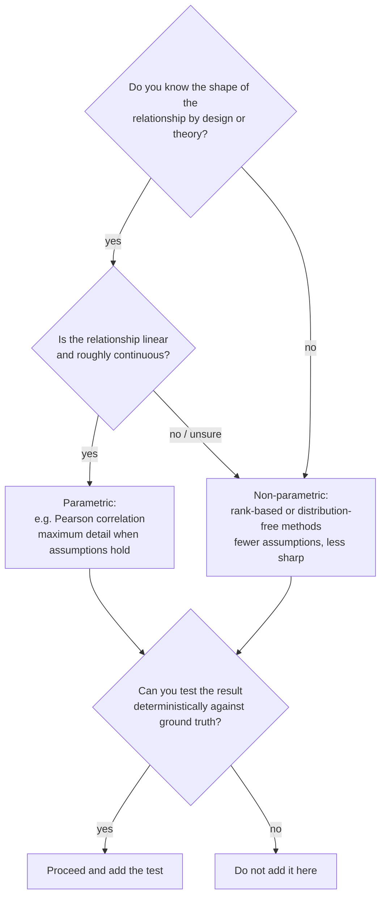

# Methods

Audience: new contributors, including those new to data science. This document describes how the repository actually works today (`## Done`), what is deliberately not built (`## Intended`), why the design looks the way it does, and the working rules that keep it trustworthy. Every statement is grounded in the current code, tests, documentation, and open issues.

---

## Done

These behaviors exist and are covered by tests or by the boundary scanner:

1. **Seed-controlled synthetic generation.** `SyntheticPlasticityModel(seed=...)` owns a private pseudorandom generator (`random.Random(seed)`). `generate_observations(count)` returns `count` frozen `SyntheticObservation` records, each pairing an `error_signal` drawn uniformly from -1.0 to 1.0 with a `plasticity_index` computed as `0.4 * error_signal` plus Gaussian noise (mean 0, standard deviation 0.25). Equal seeds and equal calls produce equal in-memory sequences; `tests/test_public_boundary.py::test_synthetic_generation_is_repeatable_for_equal_seeds` verifies this.
2. **Input validation on generation.** `generate_observations` raises `ValueError` for `count <= 0`.
3. **A guarded association summary.** `summarize_association` returns the two means and the Pearson correlation coefficient of the supplied synthetic values. It raises `ValueError` when fewer than two observations are supplied and when either field has zero variation (which would force a division by zero). The insufficient-input guard is covered by `test_summary_requires_multiple_observations`.
4. **A public-boundary scanner.** `tools/check_public_boundary.py` lists tracked files via `git ls-files`, flags prohibited path names (for example `results/`, `data/`, `figures/`) and prohibited file suffixes (for example `.csv`, `.png`, `.ipynb`), and scans approved text files for contact patterns, reserved identifier patterns, publication-oriented language, and numeric outcome claims. Tests cover one blocked path and one allowed path.
5. **Standard-library-only, in-memory-only operation.** The model never reads or writes files, downloads anything, or touches a network. `docs/METHODS_SCOPE.md` documents this scope; `docs/RELEASE_BOUNDARY.md` defines what may be tracked.

Validation commands that must pass before any change is proposed:

```bash
python tools/check_public_boundary.py
python -m unittest discover -s tests -v
```

## Intended

These are planned or open, not implemented. Each item links to its tracking issue, and none of them license adding data to this tree.

1. **More data-free tests** (issues #11, #12, #13, then verification issue #16): a nonpositive-count test for `generate_observations`, a no-variation test for `summarize_association`, and a scanner test for a prohibited suffix such as `.csv`, followed by an integration review.
2. **Documentation clarifications** (issues #8, #9, #10, #14, #15): a seed-repeatability walkthrough, clearer constructed-association wording, contributor-facing acceptance criteria for summary safeguards, and a docstring clarification for `SyntheticObservation`.
3. **A gated empirical-evaluation plan** (issue #17): planning only. Any future empirical work must predefine the setting, measures, inclusion rules, analysis, and interpretation limits, and requires the maintainer-scientific-owner approval gate plus a separate appropriate location. Observed material stays out of this public repository regardless of outcome.

There is currently **no** data ingestion, no benchmark, no figure pipeline, no provenance layer, and no result-reporting workflow — and there will not be one in this tree without an explicit boundary change (see `docs/DEFERRED_AND_DROPPED_DIRECTIONS.md`).

## Design decisions and why

**Standard library only.** The model uses `dataclasses`, `random`, `math`, and `statistics` — nothing else. Why: zero installation friction, zero dependency risk, and a hard ceiling on how much machinery can hide inside a "simple example."

**One private generator per model instance.** The seed feeds an instance-owned `random.Random`, not the global random module. Why: creating two models with the same seed is then guaranteed independent of anything else the process is doing, which is what makes the repeatability test honest.

**Frozen dataclass observations.** `SyntheticObservation` is immutable. Why: a summary computed over observations nobody can have mutated mid-analysis removes a whole class of subtle bugs, and equality of two generated sequences becomes a plain value comparison the test can assert directly.

**In-memory only.** No method writes a file. Why: the release boundary forbids tracked outputs and data artifacts; making output impossible in code is stronger than promising not to do it.

**Fail loudly on underspecified input.** The summary raises `ValueError` instead of guessing for too few observations or zero variation. Why: in a teaching codebase, a wrong number is worse than an exception; the guards also document, in executable form, what a correlation requires to be meaningful.

**A conservative static scanner, plus human review.** The scanner blocks known-dangerous paths, suffixes, and text patterns. Why: most boundary accidents are mechanical (a stray `.csv`, a `results/` folder), and catching them automatically frees review time for judgment calls the scanner explicitly does not make.

### Currently undecided — options and selection rule

| Question | Option A | Option B | Selection rule |
|---|---|---|---|
| Plasticity rule variant | Keep the single linear coupling `0.4 * error + noise` | Add a second variant (e.g., a thresholded or saturating coupling) | Add a variant only if it answers a stated teaching question the linear rule cannot; otherwise keep one rule so the ground truth stays trivially auditable |
| Stability of generated values | Keep fixed bounded range (-1.0 to 1.0) | Allow configurable ranges | Configure only when a test or doc example needs it; a bounded fixed range keeps every sequence finite and comparable by default |
| "Step size" | The model has no time steps — each observation is one independent draw | Introduce a time series with step size dt | Introduce dt only alongside a documented dynamical question; without one, per-draw independence is simpler and fully deterministic |
| Summary statistics | Means and one correlation coefficient | Additional statistics (slopes, ranks, intervals) | Add only statistics that have a deterministic test; a number nobody tests is a liability, not a feature |

## Parametric vs non-parametric: a decision guide

The current summary is **parametric**: Pearson's correlation assumes a straight-line relationship and is sensitive to how values are distributed. A **non-parametric** alternative (e.g., a rank correlation) would ask only whether the two fields tend to increase together, ignoring shape. For this repository the parametric choice is correct *because the ground truth is a straight line by construction* — but contributors should know how to choose in general.



Concrete rules for this repo:

- If the generator's coupling is linear (as now), Pearson is the intended summary; rank methods would discard known information.
- If a future variant adds a nonlinear coupling, pair it with a matching summary in the same change, or do not merge the variant.
- Never add a statistic whose expected value cannot be stated in advance; "explore what comes out" is how constructed numbers get misread as findings.

## Hygiene: the working rules

**Seeds.** Every example and test passes an explicit seed (the tests use `seed=3`; the README example uses `seed=7`). Never rely on an unseeded run for anything another person must reproduce. A seed is a promise about repeatability of *software behavior* — it says nothing about the real world.

**Simulation determinism.** Equal seeds plus equal calls must yield equal sequences, byte-for-byte in memory. This works because the generator is instance-owned and observations are immutable. If you add randomness anywhere, it must draw from the instance generator, not the global one — otherwise determinism silently breaks and the repeatability test becomes a coin flip.

**Synthetic ground truth.** The true relationship (`slope 0.4`, uniform errors, Gaussian noise) is written down in code and in this document. Any summary, doc example, or test must be checkable against that ground truth. If a statement cannot be traced to the code, it does not belong in the repo.

**Test discipline.** Tests are data-free: in-memory values and path strings only, no fixtures, no downloads, no files created. New behavior ships with its test in the same change; a feature without a test is treated as unfinished. Run both validation commands before proposing anything, and treat the scanner's pass as "no known violation found," never as evidence for a scientific claim.

**Claim discipline.** The strongest sentence this repository may ever support is "the synthetic software behaves as documented." Constructed associations are not observed effects; safeguards are not validations; plans for empirical work (issue #17) are gated and live outside this tree until approved.

## Where to go next

- Behavior contracts: `src/synthetic_model.py` docstrings
- Test patterns to copy: `tests/test_public_boundary.py`
- Contribution workflow and future testing opportunities: `CONTRIBUTING.md`
- Scope and limits: [Methods scope](METHODS_SCOPE.md), [Release boundary](RELEASE_BOUNDARY.md), [Deferred directions](DEFERRED_AND_DROPPED_DIRECTIONS.md)
- Concept background: [Extended introduction](EXTENDED_INTRODUCTION.md)
