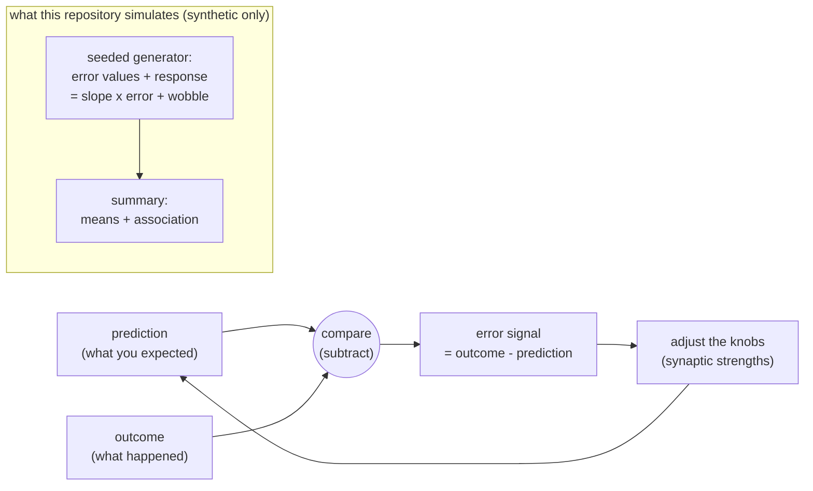

# Concept Figure: Error-Driven Plasticity as a Knob-Turning Loop

This file is the tracked, text-only stand-in for the repository's concept
figure. The public release boundary does not permit image files or figure
directories in the tracked tree (see `tools/check_public_boundary.py` and
[RELEASE_BOUNDARY.md](RELEASE_BOUNDARY.md)), so the figure is expressed here
as a Mermaid diagram that any Markdown viewer with Mermaid support renders
automatically.

**Caption:** Error-driven learning in one loop. A prediction and an outcome
are compared; the mismatch — the error signal — adjusts the connection
strengths (knobs) that produced the prediction; the adjusted knobs make the
next prediction. In AI this loop is established technology; whether
biological synapses implement it is an open hypothesis. The repository
simulates only the shaded part: a seeded generator of error-like values and
a response that follows them with a fixed slope, plus a descriptive
association summary.

Reading the diagram:

1. The loop is the classic error-driven learning idea: compare, compute the
   mismatch, adjust, repeat.
2. The **knobs** are synaptic strengths; adjusting them is plasticity. The
   worked single-synapse arithmetic is in
   [EXTENDED_INTRODUCTION.md](EXTENDED_INTRODUCTION.md), section 5.
3. The shaded box is all this repository implements — a deterministic,
   seed-controlled synthetic generator and a descriptive summary. The
   relationship it finds is programmed in by construction, not discovered,
   and no biological claim is made.
